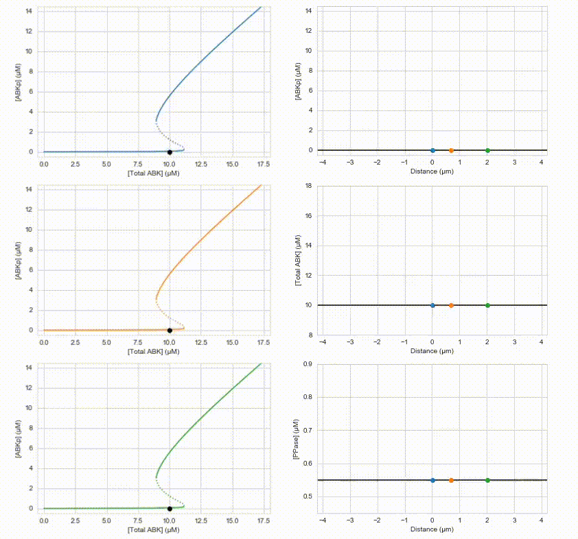

Unpublished MSc Thesis. Reaction-diffusion-localization dynamical system.

<b>Author:</b> Patrick Govoni  
<b>Supervisor:</b> Prof. Lendert Gelens  
<b>Affiliation:</b> Department of Cellular and Molecular Medicine, KU Leuven  
<b>Group:</b> Dynamics in Biological Systems  
<b>Years:</b> 2020-2021

[Github Repo](https://github.com/pgovoni21/ABKinase-bistability-traveling-front-dynamics)

<b>Abstract:</b>

Reliable chromosome segregation is vital to an organism’s long-term survival. Aurora B kinase, one of the key players in this critical mitotic event, uses a spatial gradient in activity to help selectively stabilize kinetochore-microtubule attachments and achieve properly balanced biorientation before chromatid splitting in anaphase. A popular theory asserts that Aurora B kinase (ABK) achieves this spatial gradient through the combination of localization, diffusion, and bistable reaction kinetics together with phosphatase (PPase). In this report I will discuss the individual aspects of these components in a theoretical context, the experimental effort to construct a minimal kinase-phosphatase system, as well as simulation explorations of the system using two different modeling approaches.