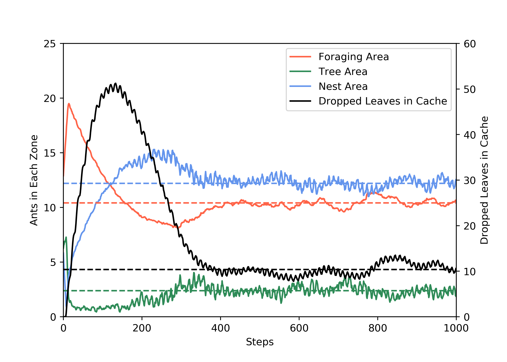

Project stemming from a modeling course in my MSc program. Agent-based model of the cellular automata variety.

<b>Author:</b> Patrick Govoni & Kin Ho Chan

<b>Supervisor:</b> Piet Van Den Berg & Prof. Tom Wenseleers

<b>Affiliation:</b> Department of Biology, KU Leuven

<b>Group:</b> Lab of Socioecology & Social Evolution

<b>Years:</b> 2020-2022

[Github Repo](https://github.com/pgovoni21/ants-task-partitioning-ABM)

<b>Abstract:</b>

Social insects owe their widespread success to their ability to efficiently coordinate behaviour to carry out complex tasks. Several leaf-cutter ant species employ an advanced type of division of labour known as task partitioning, where the task of retrieving leaves is distributed between workers that cut and drop and those that collect the fallen leaves. It is not entirely clear how such highly coordinated behaviour can evolve, as it would seem to require the simultaneous mutations of multiple traits during the same generation. Here, we use an agent-based simulation model to show how task partitioning in leaf-cutter ants can gradually evolve by exploiting stigmergy (indirect coordination through the environment) through gravity (leaves falling from the treetop on the ground forming a cache). Our simple model allows independent variation in two core behavioural dimensions: the tendency to drop leaves and the tendency to pick up dropped leaves. Task partitioning readily evolves even under these minimal assumptions through adaptation to an arboreal environment where traveling up and down the tree is costly. Additionally, we analyse ant movement dynamics to demonstrate how the ants achieve efficient task allocation through task switching and negative feedback control.