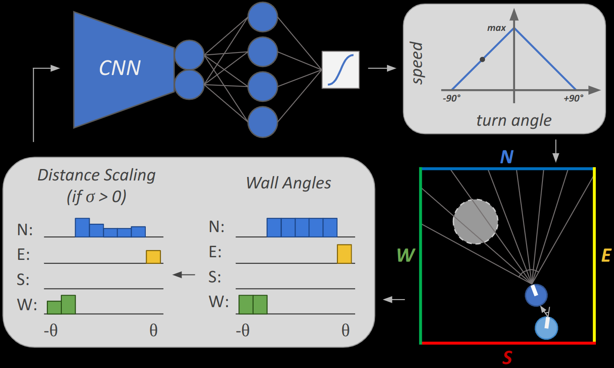

PhD Thesis - Part One. Visual-motor learning of artificial neural networks.

<b>Author:</b> Patrick Govoni

<b>Supervisor:</b> Pawel Romanczuk

<b>Affiliation:</b> Institute for Theoretical Biology, Humboldt Universität zu Berlin

<b>Group:</b> Collective Information Processing Lab

<b>Years:</b> 2023-Present

[Preprint](https://arxiv.org/abs/2407.13535)

[Github Repo](https://github.com/pgovoni21/vis-nav-abm)

[Talk @ ScioI Summer School 2023](https://pgovoni21.github.io/talks/2023-08-23-scioi_summer_school)

[Talk @ ALife 2024](https://pgovoni21.github.io/talks/2024-07-24-alife)

[Extended Abstract @ ALife 2024](https://direct.mit.edu/isal/proceedings/isal2024/36/40/123487)

  
  
  

  
  
  

<b>Abstract:</b>

Navigation is controlled by at least two partially dissociable, concurrently developed systems in the brain. The cognitive map informs an organism of its location and bearing, updated by distance-based prediction and vestibular integration. Response-based systems, on the other hand, directly evaluate movement decisions from immediate percepts. Here we demonstrate the sufficiency of visual response-based decision-making in a classic open field navigation task often assumed to require a cognitive map. Three distinct strategies emerge to robustly navigate to a hidden goal, each conferring contextual tradeoffs, as well as aligning with behavior observed with rodents, insects, fish, and sperm cells. We propose reframing navigation from the bottom-up, without assuming online access to computationally expensive top-down representations, to better explain behavior under energetic or attentional constraints.