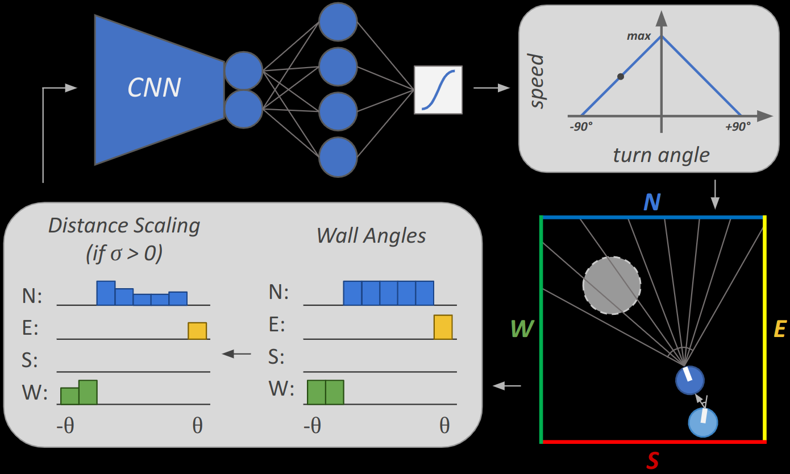
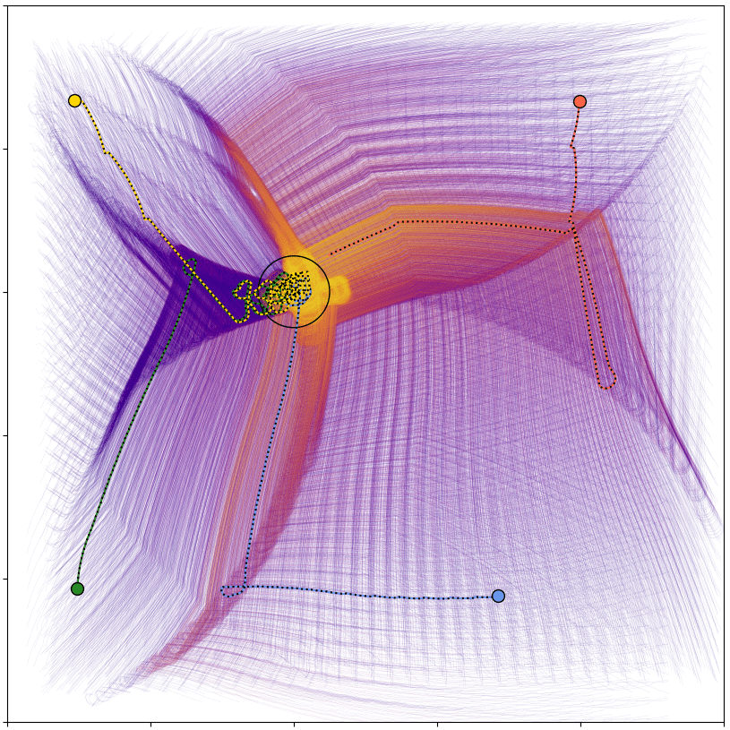
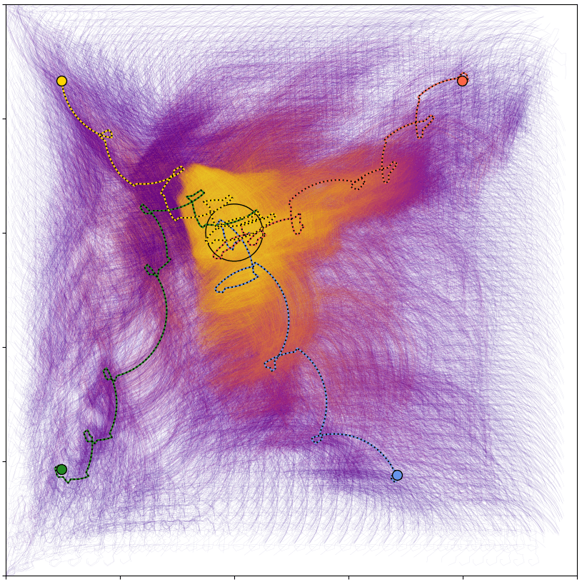
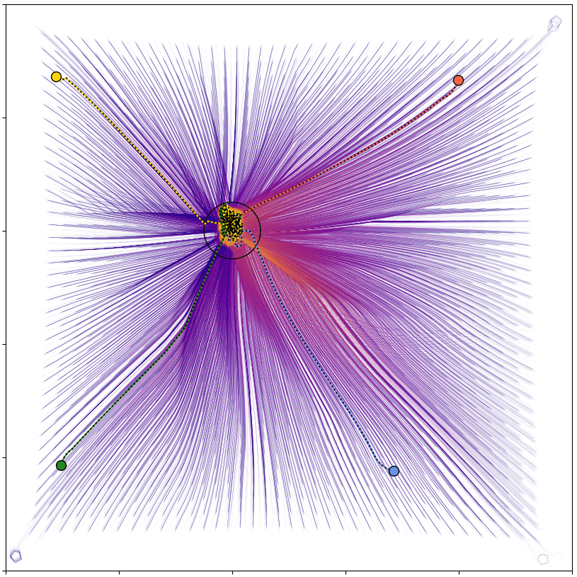

PhD Thesis - Part One  
Learning to navigate using visual-motor neural nets.

<b>Author:</b> Patrick Govoni  
<b>Supervisor:</b> Pawel Romanczuk  
<b>Affiliation:</b> Institute for Theoretical Biology, Humboldt Universität zu Berlin  
<b>Group:</b> [Collective Information Processing Lab](http://lab.romanczuk.de/)  
<b>Years:</b> 2023-Present

[Preprint](https://arxiv.org/abs/2407.13535)  
[Github Repo](https://github.com/pgovoni21/vis-nav-abm)  

<b>Abstract:</b>

Navigation is believed to be controlled by at least two partially dissociable systems in the brain. The cognitive map informs an organism of its location and bearing, updated by integrating vestibular self-motion or predicting distances to landmarks. Route-based navigation, on the other hand, directly evaluate sequential movement decisions from immediate percepts. Here we use a minimal perception-action model to demonstrate the sufficiency of visual route-based decision-making in a classic open field navigation task often assumed to require a cognitive map. Three distinct strategies emerge to robustly navigate to a hidden goal, each conferring contextual tradeoffs analyzed at both neural and behavioral scales, as well as qualitatively aligning with behavior observed across the biological spectrum. We propose reframing navigation from the bottom-up, through an egocentric sequential perspective without assuming online access to computationally expensive top-down representations, to better explain behavior under energetic or attentional constraints.

  
  
  

  
  
  

[Talk @ ScioI Summer School 2023](https://pgovoni21.github.io/talks/2023-08-23-scioi_summer_school)  
[Talk @ ALife 2024](https://pgovoni21.github.io/talks/2024-07-24-alife)  
[Extended Abstract @ ALife 2024](https://direct.mit.edu/isal/proceedings/isal2024/36/40/123487)  
[Talk @ EI 2025](https://pgovoni21.github.io/talks/2025-04-02-EI25)  
[Talk @ EI 2026](https://pgovoni21.github.io/talks/2026-03-19-EI26)  